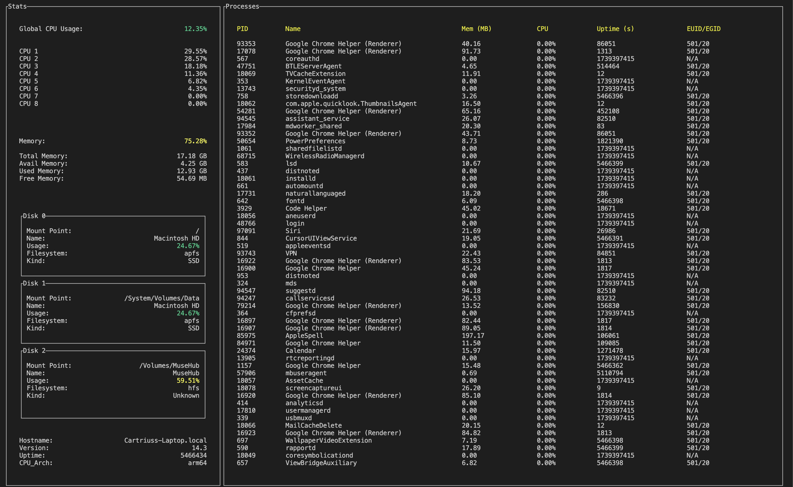

# Rust Resource Manager

A **terminal-based resource manager** written in Rust, featuring a text-based UI (TUI) for monitoring system resources and processes.  
It displays CPU usage (global and per-core), memory usage, disk usage, and a live list of processes. Color coding is applied to usage values for quick at-a-glance monitoring.



## Features

- **CPU Usage** (global and per-core):
  - Color-coded usage percentages in green, yellow, or red (depending on severity).
- **Memory Usage**:
  - Shows percentage used plus total/available/used/free details.
- **Disk Usage**:
  - Each mounted disk’s usage (percentage), filesystem, mount point, and kind.
- **Processes**:
  - Lists PID, name, memory (in MB), CPU usage, uptime (in seconds), and EUID/EGID.
- **System Info**:
  - Hostname, OS version, uptime, CPU architecture, etc.
- **Keyboard Control**:
  - Press `q` or ESC to quit at any time.

## How It Works

1. **Sysinfo**: Gathers all process, CPU, and memory data from your system.
2. **Crossterm + TUI**:  
   - `Crossterm` handles raw-mode terminal input, enabling you to capture keystrokes without normal line buffering.  
   - `tui` draws the text-based interface, creating widgets for blocks, tables, paragraphs, etc.
3. **Modules**:
   - `system.rs`: collects global CPU/memory/disk usage, plus OS metadata.  
   - `processes.rs`: collects per-process data (PID, memory, CPU, etc.).  
   - `ui.rs`: lays out the screen, splits it into a left “Stats” column and a right “Processes” column, applies color-coded usage, etc.
4. **Event Loop** in `main.rs`:
   - Every ~400ms, the system data is refreshed.  
   - The UI is redrawn with the updated data.  
   - If the user presses `q` or ESC, the loop breaks and the terminal is restored to normal mode.

## Installation & Usage

1. **Install Rust** if you haven’t already:  
   ```bash
   curl --proto '=https' --tlsv1.2 https://sh.rustup.rs -sSf | sh
   ```

2. **Clone this repo**
   ```bash
   git clone https://github.com/your-username/resource-manager.git
   cd resource-manager
   ```
3. **Build and run**
   ```bash
   cargo run
   ```
4. **Press `q` or ESC** to exit the TUI.
